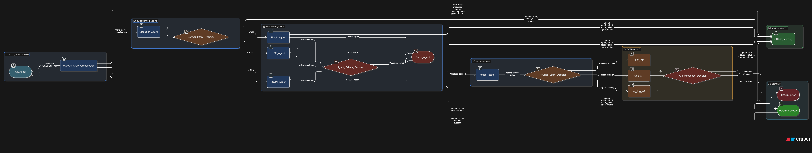

# Multi-Agent AI System with MCP Orchestration

> **A self-driving pipeline that ingests files, reasons over them with LLMs, and triggers follow-up actions—robust, transparent, and fun to hack on.**

---

## 1. Overview

This repository implements a **multi-agent AI workflow** orchestrated by a **Model Context Protocol (MCP)** layer. Each incoming file (PDF, JSON, or TXT/Email) is:

1. **Received** via an API (FastAPI).
2. **Classified** by the Classifier Agent to determine format and business intent.
3. **Routed** to one of three specialist agents (Email, PDF, JSON) to extract structured data or validate schema.
4. **Chained** into follow-up actions (e.g., CRM escalation, risk alerts, logging) via the Action Router.
5. **Logged** at every step into a single SQLite “memory” table (`workflow_run`), creating an append‐only audit trail.

By storing intermediate state in SQLite and using a small retry framework, this pipeline is resilient to crashes or network failures. Future UI layers (React, Streamlit, etc.) can query the memory and show detailed run histories in real time.

---

## 2. Video Demo

Below is a quick demo of the pipeline in action. Click the thumbnail to watch:

[]

> Replace `VIDEO_ID` with your actual YouTube video ID once uploaded. If you prefer Google Drive, paste the shareable link in place of the YouTube URL above.

---

## 3. Architecture




---

---
## 4. 🎯 Key Features

### 🧩 Modular Agent Architecture
- **Classifier Agent**: Splits files by format and intent.
- **Email Agent**: Extracts sender, mood, and urgency.
- **PDF Agent**: Handles invoices and policy documents, with OCR fallback support.
- **JSON Agent**: Validates schemas and flags anomalies.

### 🔄 MCP Orchestration Layer
- Generates a unique `run_id` for each file.
- Manages shared context and in-memory updates.
- Ensures full traceability — no state is lost, even after a crash.

### 🚦 Action Routing
- Rule-based or LLM-assisted decision-making.
- Triggers external services (e.g., simulated CRM, risk alerts, logging).
- Includes retry logic with exponential backoff for robust delivery.

### 🗂️ Persistent Memory with SQLite
- Uses a single `workflow_run` table as an event-sourced ledger.
- Maintains an **append-only history log** for auditability.
- Ensures **atomic updates** at each pipeline stage.

### ⚡ FastAPI-Based API
- `POST /process/file` – Upload and trigger a processing run.
- `GET /runs/{run_id}` – Retrieve full run history and current status.
- Comes with **Swagger UI** for interactive API documentation.

---

## 5. Folder Structure

```
FlowbitAI/
├── .gitignore
├── LICENSE
├── README.md
├── app/                              # Backend (FastAPI server)
│   ├── __init__.py
│   ├── .env
│   ├── app.log
│   ├── config.py                     # Global configuration settings
│   ├── main.py                       # Primary FastAPI entry point
│   ├── main1.py                      # Alternate/main entry point (if applicable)
│   ├── memory.db                     # SQLite database for workflow history
│   ├── memory1.db                    # Alternative SQLite database copy
│   ├── agents/                       # Agent implementations (e.g., classification)
│   │   ├── __init__.py
│   │   └── ClassifierAgent.py
│   ├── core/                         # Core logic and utilities
│   │   ├── __init__.py
│   │   └── ActionRouter.py           # Routes actions based on agent results
│   ├── memory/                       # MemoryStore for database interaction
│   │   ├── __init__.py
│   │   └── MemoryStore.py
│   ├── processor/                    # File processing logic (extraction, OCR)
│   │   ├── __init__.py
│   │   └── fileProcessor.py
│   ├── router/                       # Routing logic for agents
│   │   ├── __init__.py
│   │   └── AgentRouter.py
│   └── test/                         # Testing scripts and notebooks
│       ├── __init__.py
│       └── testDB.ipynb
├── client/                           # Frontend (React/Vite)
│   ├── .gitignore
│   ├── eslint.config.js
│   ├── index.html
│   ├── package.json
│   ├── README.md
│   ├── vite.config.js
│   ├── public/
│   │   └── favicon.ico
│   └── src/
│       ├── App.jsx                 # Main React component handling UI and routing display
│       └── staticRoutingData.js    # Static routing log mappings for sample file outputs
└── sampleFiles/                      # Sample documents for testing
    ├── Architecture.png             # Diagram of system architecture
    ├── json/
    │   └── sample1.json
    ├── pdfs/
    │   ├── invoice.pdf
    │   └── receipt.pdf
    └── txt/
        ├── sample1.txt
        └── sample3.txt

```

---

## 🧠 6. Memory and Persistence

All state is stored in a single **SQLite** table called `workflow_run`.

### 🗃️ Table Schema

```sql
CREATE TABLE IF NOT EXISTS workflow_run (
    run_id TEXT PRIMARY KEY,
    source TEXT NOT NULL,
    file_path TEXT NOT NULL,
    original_ext TEXT NOT NULL,
    received_at DATETIME DEFAULT CURRENT_TIMESTAMP,
    detected_format TEXT,
    intent TEXT,
    llm_classification TEXT,
    email_agent_output TEXT,
    pdf_agent_output TEXT,
    json_agent_output TEXT,
    routed_to_agent TEXT,
    action_taken TEXT,
    action_payload TEXT,
    action_status TEXT,
    current_status TEXT,
    last_updated DATETIME,
    history TEXT
);
```

### 📄 Column Descriptions

- **`run_id`**: UUID string, unique per file.
- **`source`**: Source of the file (e.g., `"upload"`, `"webhook"`, `"api"`).
- **`file_path`**: Local path where the file is saved.
- **`original_ext`**: File extension (e.g., `"pdf"`, `"json"`, `"txt"`).
- **`received_at`**: Timestamp when the file was first ingested.
- **`detected_format`**: Output of the Classifier Agent (e.g., `"PDF"`, `"Email"`, `"JSON"`).
- **`intent`**: Business intent identified by the classifier (e.g., `"Invoice"`, `"Complaint"`, `"Fraud Risk"`).
- **`llm_classification`**: Raw LLM or heuristic output used for classification.
- **`email_agent_output`**: JSON blob with fields like:  
  `{ sender, urgency, tone, issue_summary, suggested_action }`
- **`pdf_agent_output`**: Extracted data from PDFs (e.g., invoice fields or policy flags).
- **`json_agent_output`**: JSON structure like:  
  `{ valid, fields, anomalies }` after schema validation.
- **`routed_to_agent`**: Name of the agent that processed the file (e.g., `"email_agent"`, `"pdf_agent"`).
- **`action_taken`**: Action the system decided to perform (e.g., `"escalate_crm"`, `"log_and_close"`).
- **`action_payload`**: JSON object sent to external services.
- **`action_status`**: `"pending"`, `"success"`, or `"failed"`.
- **`current_status`**: Current workflow stage:  
  `"received"` → `"classified"` → `"processed"` → `"complete"` or `"error"`
- **`last_updated`**: Last time the row was modified.
- **`history`**: Append-only JSON array of workflow events, each with timestamp, event type, and details.

---

### 🔄 Update Logic

Each orchestrator stage or agent uses `db_manager.update_*` functions to:

- ✅ Write its results to the `workflow_run` table.
- 📜 Append the corresponding event to the `history` log.

> This allows full traceability and recovery in case of crashes or restarts.

---

## 7. 🧪 Testing

Our tests are organized within the `app/test` folder and use a mix of Python scripts and Jupyter notebooks. Here's an overview of how testing is performed:

### Database Testing (`testDB.ipynb` & `testDB.py`)

- A Jupyter Notebook (`testDB.ipynb`) connects to the SQLite database (`memory1.db`).
- It iterates over the `workflow_run` table, retrieves column names from the cursor description, and prints each record with its values.
- Additionally, a Python script version (`testDB.py`) runs the same queries from the command line, enabling easier integration with continuous integration (CI) workflows.

### Agent Testing (`test_agents.py`)

- The script `test_agents.py` in `app/test` calls agent functions (e.g., the classifier in `agents/ClassifierAgent.py`) with sample file paths.
- It prints classification results for various file types (TXT, PDF, JSON, and unknown files) to verify routing logic and classification behavior.

### Exploratory & Debugging

- Tests verify each processing stage independently: file ingestion, classification, DB updates, and routing.
- Notebooks and scripts enable developers to experiment with inputs, review logs, and trace errors efficiently.

> This modular testing structure ensures that each component — agent logic or database interaction — is validated individually, maintaining robustness and simplifying debugging throughout the pipeline.

---

## 8. Installation

> **Note:** The code is under active development.  
> This section will be updated once additional scripts, Docker files, and front-end clients are added.

---


## 📜 License

This project is licensed under the **MIT License**.  
Feel free to fork, modify, and share.

---

Thanks for checking out this Multi-Agent AI System!

If you build something cool with it or have improvements, let me know.  
Keep hacking, keep innovating. 🎉
